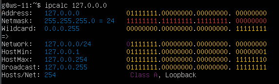
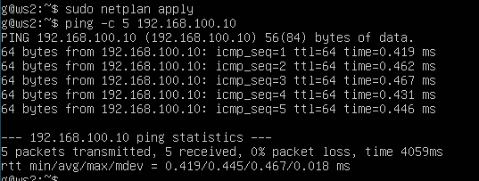
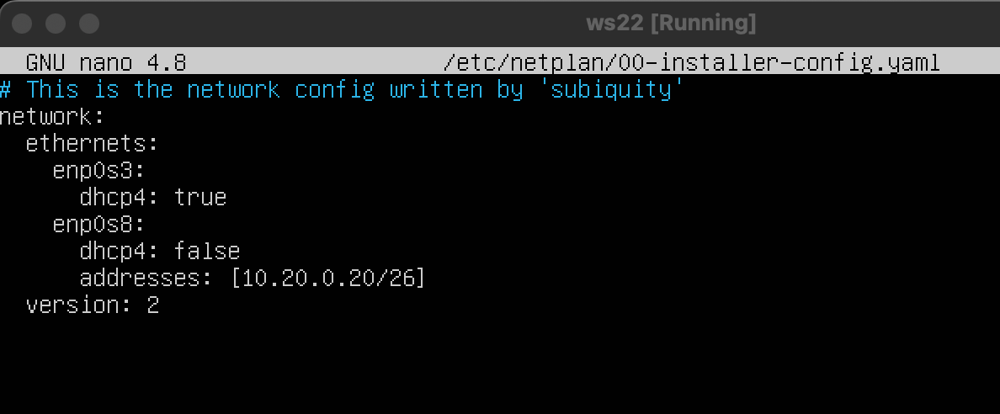
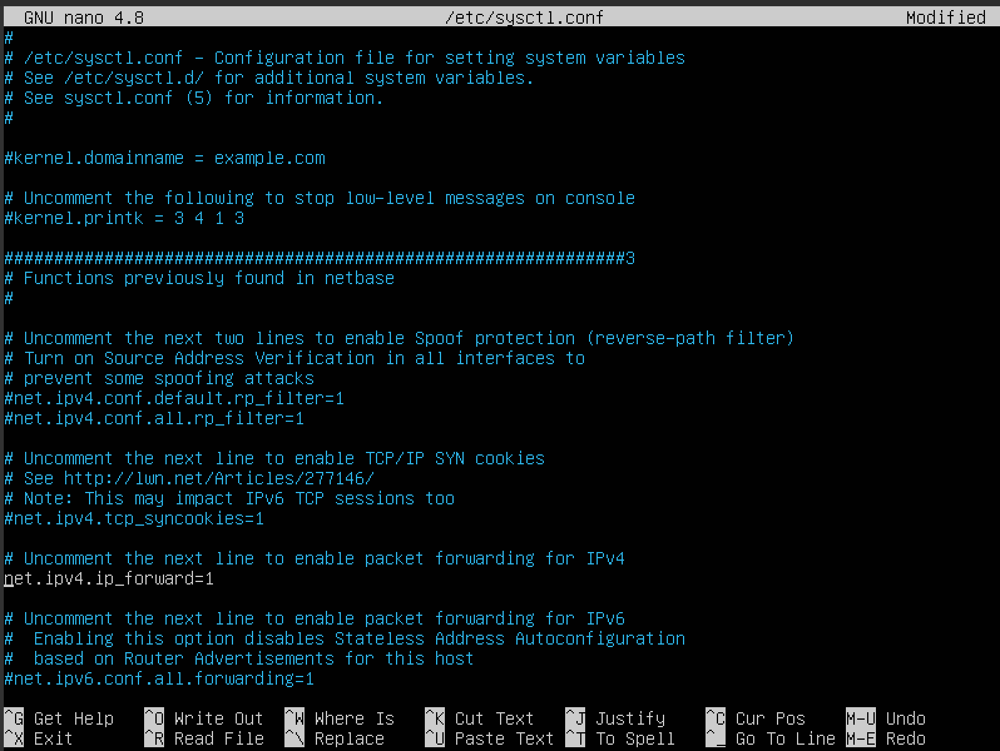
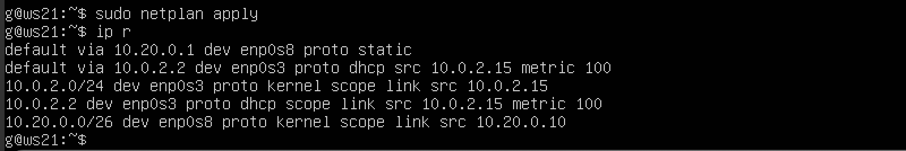
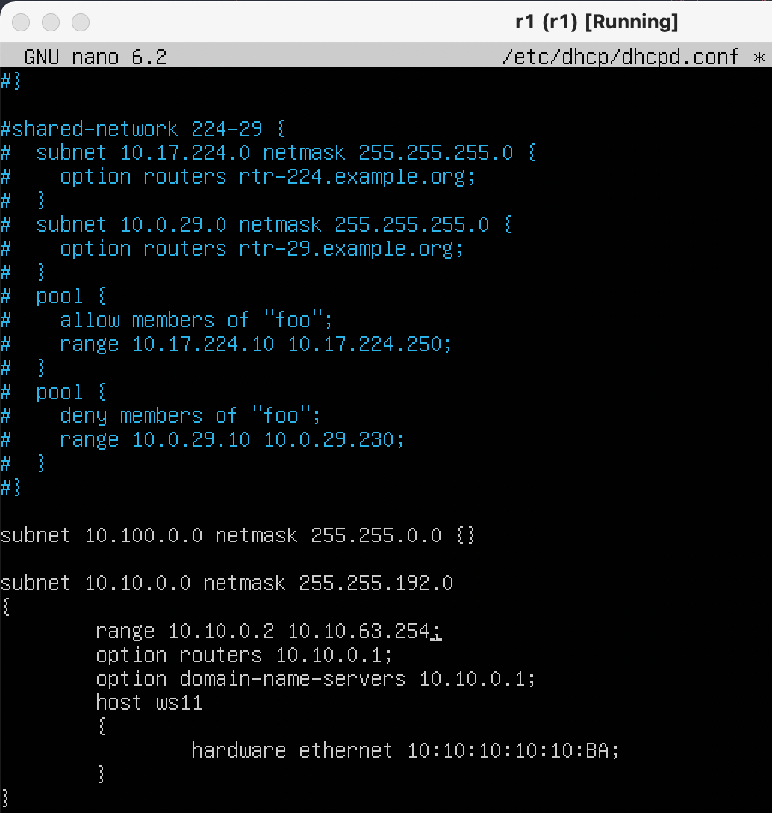
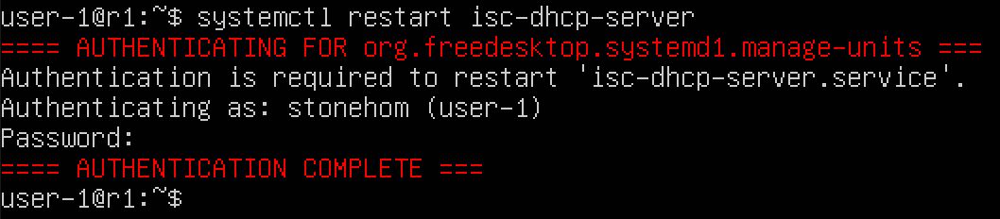
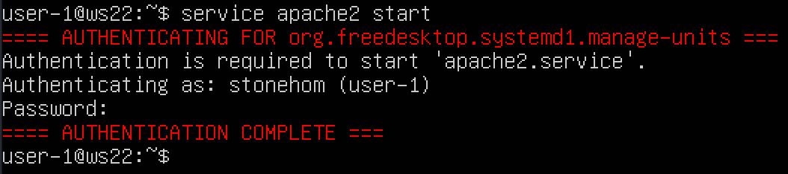
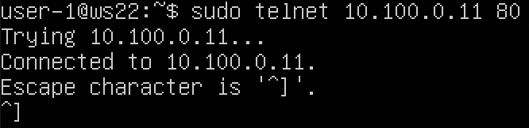

# Linux Network

## Part 1. Инструмент **ipcalc**

- Поднять виртуальную машину (далее -- ws1)
>
> - **Описание `ipcalc`**:
>   - `ipcalc` предоставляет простой метод для вычисления IP-информации хоста. Различные опции определяют, какую информацию `ipcalc` должен вывести на стандартный выход. Могут быть заданы несколько опций. Обрабатываемый IP-адрес всегда должен быть указан. Для большинства операций также требуется сетевая маска или префикс CIDR.
> - **Некоторые из применений `ipcalc`**:
>   - Проверить IP-адрес
>   - Показать рассчитанный широковещательный адрес
>   - Отображение имени хоста, определенного через DNS
>   - Показать сетевой адрес или префикс
> - **Использование**
>   - ipcalc [OPTION]... IP address[/prefix] [netmask]
>
- Обновим пакеты по необходимости:
  - `sudo apt-get update && sudo apt-get upgrade`
- Установим утилиту
  - `sudo apt-get -y install ipcalc`

### 1.1. Сети и маски

- Определить и записать в отчёт:
- 1) Адрес сети *192.167.38.54/13*
  - 192.160.0.0
  
- 2) Перевод маски
  - *255.255.255.0* в префиксную и двоичную запись,
    - /24 - префиксная
    - 11111111.11111111.11111111.00000000 - двоичная

    

  - */15* в обычную и двоичную,
    - 255.254.0.0 - обычная
    - 11111111.11111110.00000000.00000000 - двоичная

    
  - *11111111.11111111.11111111.11110000* в обычную и префиксную
    - 255.255.255.240 - обычная
    - /28 - префиксная

    

- 3) Минимальный и максимальный хост в сети *12.167.38.4* при масках:
- */8*,
  - 12.0.0.1 - min
  - 12.255.255.254 - max

  
- *11111111.11111111.00000000.00000000*,
  - 12.167.0.1 - min
  - 12.167.255.254 - max

  
- *255.255.254.0*
  - 12.167.38.1 - min
  - 12.167.38.254 - max

  
- */4*
  - 0.0.0.1 - min
  - 15.255.255.254 - max

  

### 1.2. localhost

- Определить и записать в отчёт, можно ли обратиться к приложению, работающему на localhost, со следующими IP:

> Адреса на localhost должны находиться в диапазоне 127.0.0.1 - 127.255.255.254
> 

- *194.34.23.100* -  нельзя
- *127.0.0.2* - можно
- *127.1.0.1* - можно
- *128.0.0.1* - нельзя

### 1.3. Диапазоны и сегменты сетей
>
> Частные IP адреса:
>
>  1) от 10.0.0.0 до 10.255.255.255 с маской 255.0.0.0 или /8;
 > 2) от 172.16.0.0 до 172.31.255.255 с маской 255.240.0.0 или /12
 > 3) от 192.168.0.0 до 192.168.255.255 с маской 255.255.0.0 или /16
 > 4) от 100.64.0.0 до 100.127.255.255 с маской подсети 255.192.0.0 или /10
>
- Определить и записать в отчёт:
- 1) какие из перечисленных IP можно использовать в качестве публичного, а какие только в качестве частных:
- *10.0.0.45* - частный
- *134.43.0.2* - публичный
- *192.168.4.2* - частный
- *172.20.250.4* - частный
- *172.0.2.1* - публичный
- *192.172.0.1* - публичный
- *172.68.0.2* - публичный
- *172.16.255.255* - частный
- *10.10.10.10* - частный
- *192.169.168.1* - публичный
- 2) какие из перечисленных IP адресов шлюза возможны у сети *10.10.0.0/18*:

> Диапазон доступных сетей: 10.10.0.1 - 10.10.63.254
> 

- *10.0.0.1* - нет
- *10.10.0.2* - да
- *10.10.10.10* - да
- *10.10.100.1* - нет
- *10.10.1.255* - да

## Part 2. Статическая маршрутизация между двумя машинами

- Поднять две виртуальные машины (далее -- ws1 и ws2)

> 
>
> Склонируем первую машину(ws1) в VirtualBox.
> На второй машине установим имя хоста ws2 и перезагрузим для отображения изменений:
>
> - `sudo hostnamectl set-hostname ws2`
> - `sudo reboot`
> - Настраиваем локальное соединение на обеих машинах через VirtualBox.


- С помощью команды `ip a` посмотреть существующие сетевые интерфейсы
- В отчёт поместить скрин с вызовом и выводом использованной команды.
- ws1
  > 
- ws2
  >
- Описать сетевой интерфейс, соответствующий внутренней сети, на обеих машинах и задать следующие адреса и маски: ws1 - *192.168.100.10*, маска */16*, ws2 - *172.24.116.8*, маска */12*
- В отчёт поместить скрины с содержанием изменённого файла *etc/netplan/00-installer-config.yaml* для каждой машины. Выполнить команду `netplan apply` для перезапуска сервиса сети. В отчёт поместить скрин с вызовом и выводом использованной команды.
- ws1
  > 
- ws2
  > 

### 2.1. Добавление статического маршрута вручную

- Добавить статический маршрут от одной машины до другой и обратно при помощи команды вида `ip r add`
- Пропинговать соединение между машинами
- В отчёт поместить скрин с вызовом и выводом использованных команд.
- ws1
  > `sudo ip r add 172.24.116.8 dev enp0s3`
  >
  > `ping 172.24.116.8`
  >
  > 
- ws2
  > `sudo ip r add 192.168.100.10 dev enp0s3`
  >
  > `ping 192.168.100.10`
  >
  > 

### 2.2. Добавление статического маршрута с сохранением

- Перезапустить машины
- `sudo reboot` x2
- Добавить статический маршрут от одной машины до другой с помощью файла *etc/netplan/00-installer-config.yaml*
- В отчёт поместить скрин с содержанием изменённого файла *etc/netplan/00-installer-config.yaml*.
- ws1
  > 
- ws2
  > 
- Пропинговать соединение между машинами
- В отчёт поместить скрин с вызовом и выводом использованной команды.
- ws1
  > `ping -c 4 172.24.116.8`
  > 
- ws2
  > `ping -c 4 192.168.100.10`
  > 

## Part 3. Утилита **iperf3**

### 3.1. Скорость соединения
>
> Базовой единицей скорости передачи информации является бит в секунду (бит/с). Разница между байтами в секунду (Б/с) и битами в секунду (бит/c) такая же, как разница между байтами (Б) и битами (бит): 1 Б/с = 8 бит/с. Точно так же разница между килобайтами в секунду (КБ/с) и Б/с такая же, как разница между килобайтами и байтами: 1 КБ/с = 1024 Б/с. И так далее.

- Перевести и записать в отчёт: 8 Mbps в MB/s, 100 MB/s в Kbps, 1 Gbps в Mbps

- 8 Mbps = 1 MB/s

- 100 MB/s = 819200 Kbps
- 1 Gbps = 1024 Mbps

### 3.2. Утилита **iperf3**
>
> **Описание `iperf3`**
>
> - `iperf3` — это инструмент для измерения пропускной способности сети. Он может тестировать TCP или пропускная способность UDP. Для выполнения теста `iperf3` пользователь должен установить как сервер, так и клиент.
> - **Использование**
>   - iperf3 -s [ options ]
>   - iperf3 -c server [ options ]
>
- Измерить скорость соединения между ws1 и ws2

> Для измерения скорости необходимо скачать утилиту iperf3 из Интернета, а сейчас у нас включена только локальное соединение между двумя машинами. Поэтому в настройках сети для каждой машины выставляем первый Adapter 1 *NAS*, а Adapter 2 - Internal Network(локальная сеть).
> 
> 
>
> Далее необходимо скорректировать yaml файлы на обеих машинах для настройки нужного порта enp0s8.
>
> - ws1
> 
> - ws2
> 
>
> Теперь устанавливаем на обе машины утилиту iperf3
>
> - `sudo apt install iperf3`
>
- В отчёт поместить скрины с вызовом и выводом использованных команд.
>
> - ws1
>
>   `iperf -s`
> 
> - ws2
>
>   `iperf -c 192.168.100.10`
> 

## Part 4. Сетевой экран

### 4.1. Утилита **iptables**
>
> - **Описание `iptables`**
>   - `iptables` используется для установки, настройки и просмотра таблиц правил фильтрации IP-пакетов в ядре Linux.
Каждая таблица содержит несколько предопределённых цепочек и может содержать цепочки, определённые пользователем. Каждая цепочка - это список правил, которые могут воздействовать на множество пакетов. Каждое правило определяет, какие действие произвести с пакетами, на которые оно действует. Эти действия называются целью, целью может быть и переход на другую (определённую пользователем) цепочку в этой же таблице. Правило брандмауэра (межсетевого экрана) определяет критерии для пакета и цели. Если пакет не попадает под действие правила, проверяется следующее правило в цепочке; если попадает - проверяется правило, указанное в цели, которая может быть именем новой цепочки или одно из специальных целей: ACCEPT, DROP, QUEUE или RETURN.
> - **Использование `iptables`**
>   - iptables [-t table] -[AD] chain rule-specification [options]
>   - iptables [-t table] -I chain [rulenum] rule-specification [options]
>   - iptables [-t table] -R chain rulenum rule-specification [options]
>   - iptables [-t table] -D chain rulenum [options]
>   - iptables [-t table] -[LFZ] [chain] [options]
>   - iptables [-t table] -N chain
>   - iptables [-t table] -X [chain]
>   - iptables [-t table] -P chain target [options]
>   - iptables [-t table] -E old-chain-name new-chain-name  
>
- Создать файл */etc/firewall.sh*, имитирующий фаерволл, на ws1 и ws2:

```shell
#!/bin/sh

# Удаление всех правил в таблице "filter" (по-умолчанию).
iptables –F
iptables -X
```

- `cd`
- `sudo touch /etc/firewall.sh`
- `sudo nano /etc/firewall.sh`
- Нужно добавить в файл подряд следующие правила:
- 1) на ws1 применить стратегию когда в начале пишется запрещающее правило, а в конце пишется разрешающее правило (это касается пунктов 4 и 5)
- 2) на ws2 применить стратегию когда в начале пишется разрешающее правило, а в конце пишется запрещающее правило (это касается пунктов 4 и 5)
- 3) открыть на машинах доступ для порта 22 (ssh) и порта 80 (http)
- 4) запретить *echo reply* (машина не должна "пинговаться”, т.е. должна быть блокировка на OUTPUT)
- 5) разрешить *echo reply* (машина должна "пинговаться")
- В отчёт поместить скрины с содержанием файла */etc/firewall* для каждой машины.
>
> - ws1
  
> - ws2
  

- Запустить файлы на обеих машинах командами `chmod +x /etc/firewall.sh` и `/etc/firewall.sh`
- В отчёт поместить скрины с запуском обоих файлов.
>
> - ws1
  
> - ws2
  

- В отчёте описать разницу между стратегиями, применёнными в первом и втором файлах.

> Разница между стратегиями заключается в том, что в первом файле первым подходящим правилом для пакета является запрет, а во втором - разрешение. Применяется только первое подходящее правило, остальные игнорируются.

### 4.2. Утилита **nmap**

- Командой **ping** найти машину, которая не "пингуется", после чего утилитой **nmap** показать, что хост машины запущен
*Проверка: в выводе nmap должно быть сказано: `Host is up`*
- В отчёт поместить скрины с вызовом и выводом использованных команд **ping** и **nmap**.

- `sudo apt install nmap`
>
> - ws1
>
>   - `ping -c 5 172.24.116.8`
>   
>   - `sudo nmap 172.24.116.8`
>   
> - ws2
>   - `ping -c 5 192.168.100.10`
>   
>   - `sudo nmap 192.168.100.10`

- Сохранить дампы образов виртуальных машин
**p.s. Ни в коем случае не сохранять дампы в гит!**

## Part 5. Статическая маршрутизация сети

- Поднять пять виртуальных машин (3 рабочие станции (ws11, ws21, ws22) и 2 роутера (r1, r2))

> Для каждой машины в VirtualBox настраиваем сетевые соединения, запускаем и изменяем имя хоста на соответствующие при помощи команды `sudo hostnamectl set-hostname <hostnamename>` и `sudo reboot`.

### 5.1. Настройка адресов машин

- Настроить конфигурации машин в *etc/netplan/00-installer-config.yaml* согласно сети на рисунке.
- В отчёт поместить скрины с содержанием файла *etc/netplan/00-installer-config.yaml* для каждой машины.
>
> - r1
>   - 
> - r2
>   - 
> - ws11
>   - 
> - ws21
>   - 
> - ws22
>   - 
>
- Перезапустить сервис сети. Если ошибок нет, то командой `ip -4 a` проверить, что адрес машины задан верно. Также пропинговать ws22 с ws21. Аналогично пропинговать r1 с ws11.
- В отчёт поместить скрины с вызовом и выводом использованных команд.
>
> - r1
>   - 
> - r2
>   - 
> - ws11
>   - 
> - ws21
>   - 
> - ws22
>   - 
>
> - Пинг ws22 с ws21 `ping -c 5 10.20.0.20`
>   - 
> - Пинг r1 с ws11 `ping -c 5 10.10.0.1`
>   - 

### 5.2. Включение переадресации IP-адресов

- Для включения переадресации IP, выполните команду на роутерах:
`sysctl -w net.ipv4.ip_forward=1`
*При таком подходе переадресация не будет работать после перезагрузки системы.*
- В отчёт поместить скрин с вызовом и выводом использованной команды.
>
> - r1
>   - 
> - r2
>   - 
>
- Откройте файл */etc/sysctl.conf* и добавьте в него следующую строку:
`net.ipv4.ip_forward = 1`
*При использовании этого подхода, IP-переадресация включена на постоянной основе.*
- В отчёт поместить скрин с содержанием изменённого файла */etc/sysctl.conf*.
>
> - 

### 5.3. Установка маршрута по-умолчанию

Пример вывода команды `ip r` после добавления шлюза:

```bash
default via 10.10.0.1 dev eth0
10.10.0.0/18 dev eth0 proto kernel scope link src 10.10.0.2
```

- Настроить маршрут по-умолчанию (шлюз) для рабочих станций. Для этого добавить `default` перед IP роутера в файле конфигураций
- В отчёт поместить скрин с содержанием файла *etc/netplan/00-installer-config.yaml*.
>
> - ws11
>   - 
> - ws21
>   - 
> - ws22
>   - 
>
- Вызвать `ip r` и показать, что добавился маршрут в таблицу маршрутизации
- В отчёт поместить скрин с вызовом и выводом использованной команды.
>
> - ws11
>   - 
> - ws21
>   - 
> - ws22
>   - 
>
- Пропинговать с ws11 роутер r2 и показать на r2, что пинг доходит. Для этого использовать команду:
`tcpdump -tn -i eth1`
- В отчёт поместить скрин с вызовом и выводом использованных команд.
>
> - ws11
>   - 
> - r2
>   - 

### 5.4. Добавление статических маршрутов

- Добавить в роутеры r1 и r2 статические маршруты в файле конфигураций. Пример для r1 маршрута в сетку 10.20.0.0/26:

```shell
# Добавить в конец описания сетевого интерфейса eth1:
- to: 10.20.0.0
  via: 10.100.0.12
```

- В отчёт поместить скрины с содержанием изменённого файла *etc/netplan/00-installer-config.yaml* для каждого роутера.
>
> - r1
>   - 
> - r2
>   - 
>
- Вызвать `ip r` и показать таблицы с маршрутами на обоих роутерах. Пример таблицы на r1:

```bash
10.100.0.0/16 dev eth1 proto kernel scope link src 10.100.0.11
10.20.0.0/26 via 10.100.0.12 dev eth1
10.10.0.0/18 dev eth0 proto kernel scope link src 10.10.0.1
```

- В отчёт поместить скрин с вызовом и выводом использованной команды.
>
> - r1
>   - 
> - r2
>   - 
>
- Запустить команды на ws11:
`ip r list 10.10.0.0/[маска сети]` и `ip r list 0.0.0.0/0`
- В отчёт поместить скрин с вызовом и выводом использованных команд.
>
> - ws11
>   - 
>
- В отчёте объяснить, почему для адреса 10.10.0.0/\[маска сети\] был выбран маршрут, отличный от 0.0.0.0/0, хотя он попадает под маршрут по-умолчанию.

> Маршрут по умолчанию имеет более низкий приоритет и срабатывает, когда не найден подходящий маршрут в таблице маршрутизации.
> 0.0.0.0/0 - это немаршрутизируемый адрес, который можно использовать в разных целях, в основном, в качестве адреса по умолчанию или адреса-заполнителя. Маршрут по умолчанию имеет более низкий приоритет и срабатывает, когда не найден подходящий маршрут в таблице маршрутизации. Для сети 10.10.0.0 мы создали правило, соответственно используется созданный маршрут. Также можно устанавливать метрику, чтобы менять приоритеты маршрутов.

### 5.5. Построение списка маршрутизаторов

Пример вывода утилиты **traceroute** после добавления шлюза:

```bash
1 10.10.0.1 0 ms 1 ms 0 ms
2 10.100.0.12 1 ms 0 ms 1 ms
3 10.20.0.10 12 ms 1 ms 3 ms
```

- Запустить на r1 команду дампа:
`tcpdump -tnv -i eth0`
- При помощи утилиты **traceroute** построить список маршрутизаторов на пути от ws11 до ws21
- В отчёт поместить скрины с вызовом и выводом использованных команд (tcpdump и traceroute).
>
> - ws11
>   - `sudo apt install traceroute`(надо сначала закомментить gateway в netplan yaml-файле.)
>   - `traceroute 10.20.0.10`
>   - 
> - r1
>   - `tcpdump -tnv -i eth0`
>   - 
>
- В отчёте, опираясь на вывод, полученный из дампа на r1, объяснить принцип работы построения пути при помощи **traceroute**.

> Принцип работы traceroute:
> Утилита отправляет целевому узлу несколько пакетов с временем жизни 1 (TTL, time to live - число переходов, которые пакет может осуществить до своего исчезновения). Следующий маршрутизатор принимает пакеты и отправляет сообщение, что время жизни пакетов истекло. traceroute фиксирует адрес этого маршрутизатора и отправляет следующие пакеты, уже с TTL 2. Так, каждый раз увеличивая TTL на 1, traceroute составляет список маршрутизаторов, через которе прошли пакеты до целевого узла.
Для определения промежуточных маршрутизаторов traceroute отправляет серию пакетов данных целевому узлу, при этом каждый раз увеличивая на 1 значение поля TTL («время жизни»). Это поле обычно указывает максимальное количество маршрутизаторов, которое может быть пройдено пакетом. Первый пакет отправляется с TTL, равным 1, и поэтому первый же маршрутизатор возвращает обратно сообщение ICMP, указывающее на невозможность доставки данных. Traceroute фиксирует адрес маршрутизатора, а также время между отправкой пакета и получением ответа (эти сведения выводятся на монитор компьютера). Затем traceroute повторяет отправку пакета, но уже с TTL, равным 2, что позволяет первому маршрутизатору пропустить пакет дальше.

### 5.6. Использование протокола **ICMP** при маршрутизации

- Запустить на r1 перехват сетевого трафика, проходящего через eth0 с помощью команды:
`tcpdump -n -i eth0 icmp`
- Пропинговать с ws11 несуществующий IP (например, *10.30.0.111*) с помощью команды:
`ping -c 1 10.30.0.111`
- В отчёт поместить скрин с вызовом и выводом использованных команд.
>
> - ws11
>   - 
> - r1
>   - 

- Сохранить дампы образов виртуальных машин
**p.s. Ни в коем случае не сохранять дампы в гит!**

## Part 6. Динамическая настройка IP с помощью **DHCP**

- Для r2 настроить в файле */etc/dhcp/dhcpd.conf* конфигурацию службы **DHCP**:
- 1) указать адрес маршрутизатора по-умолчанию, DNS-сервер и адрес внутренней сети. Пример файла для r2:

```shell
subnet 10.100.0.0 netmask 255.255.0.0 {}

subnet 10.20.0.0 netmask 255.255.255.192
{
    range 10.20.0.2 10.20.0.50;
    option routers 10.20.0.1;
    option domain-name-servers 10.20.0.1;
}
```
>
> - для начала скачаем isc-dhcp-server командой `sudo apt install isc-dhcp-server`
>
- 2) в файле *resolv.conf* прописать `nameserver 8.8.8.8.`
- В отчёт поместить скрины с содержанием изменённых файлов.
>
> - `sudo nano /etc/resolv.conf`
>   - 
>
- Перезагрузить службу **DHCP** командой `systemctl restart isc-dhcp-server`. Машину ws21 перезагрузить при помощи `reboot` и через `ip a` показать, что она получила адрес. Также пропинговать ws22 с ws21.
- В отчёт поместить скрины с вызовом и выводом использованных команд.
>
> - `systemctl restart isc-dhcp-server`
>   - 
> - `ip a`
>   - 
> - `ping -c 5 10.20.0.2`
>   - 
>
- Указать MAC адрес у ws11, для этого в *etc/netplan/00-installer-config.yaml* надо добавить строки: `macaddress: 10:10:10:10:10:BA`, `dhcp4: true`
>
> - 
>
- В отчёт поместить скрин с содержанием изменённого файла *etc/netplan/00-installer-config.yaml*.
- Для r1 настроить аналогично r2, но сделать выдачу адресов с жесткой привязкой к MAC-адресу (ws11). Провести аналогичные тесты
- В отчёте этот пункт описать аналогично настройке для r2.
>
> - `sudo nano /etc/dhcp/dhcpd.conf`
>   - 
> - `sudo nano /etc/resolv.conf`
>   - 
> - `systemctl restart isc-dhcp-server`
>   - 

- Запросить с ws21 обновление ip адреса
- В отчёте поместить скрины ip до и после обновления.
>
> - "Убиваем" старый адрес `sudo dhclient -r enp0s8`
> - Смотрим `ip a`
>   - 
> - Запрашиваем новый IP `sudo dhclient enp0s8`
> - Смотрим `ip a`
>   - 
>
- В отчёте описать, какими опциями **DHCP** сервера пользовались в данном пункте.

> Команда `sudo dhclient -r enp0s8` освобождает текущий адрес интерфейса enp0s8. Команда `sudo dhclient enp0s8` задает новый адрес указанному интерфейсу.

- Сохранить дампы образов виртуальных машин
**p.s. Ни в коем случае не сохранять дампы в гит!**

## Part 7. **NAT**

- В файле */etc/apache2/ports.conf* на ws22 и r1 изменить строку `Listen 80` на `Listen 0.0.0.0:80`, то есть сделать сервер Apache2 общедоступным
Нужно установить утилиту `sudo apt install apache2`

- В отчёт поместить скрин с содержанием изменённого файла.
- `sudo nano /etc/apache2/ports.conf`
>
> - r1
>   - 
> - ws22
>   - 
>
- Запустить веб-сервер Apache командой `service apache2 start` на ws22 и r1
- В отчёт поместить скрины с вызовом и выводом использованной команды.
>
> - r1
>   - 
> - ws22
>   - 
>
- Добавить в фаервол, созданный по аналогии с фаерволом из Части 4, на r2 следующие правила:
- 1) Удаление правил в таблице filter - `iptables -F`
- 2) Удаление правил в таблице "NAT" - `iptables -F -t nat`
- 3) Отбрасывать все маршрутизируемые пакеты - `iptables --policy FORWARD DROP`
- Запускать файл также, как в Части 4
>
> - Создаем файл `sudo touch /etc/firewall.sh`
> - Вносим необходимые команды `sudo nano /etc/firewall.sh`
>   - 
> - Даем права на исполнение `sudo chmod +x /etc/firewall.sh`
> - Запускаем `sudo sh /etc/firewall.sh`
>
- Проверить соединение между ws22 и r1 командой `ping`
*При запуске файла с этими правилами, ws22 не должна "пинговаться" с r1*
- В отчёт поместить скрины с вызовом и выводом использованной команды.
>
> - 
>
- Добавить в файл ещё одно правило:
- 4) Разрешить маршрутизацию всех пакетов протокола **ICMP**

> - Вносим необходимые команды `sudo nano /etc/firewall.sh`
> - 
> - Даем права на исполнение `sudo chmod +x /etc/firewall.sh`
> - Запускаем `sudo sh /etc/firewall.sh`
>
- Запускать файл также, как в Части 4
- Проверить соединение между ws22 и r1 командой `ping`
*При запуске файла с этими правилами, ws22 должна "пинговаться" с r1*
- В отчёт поместить скрины с вызовом и выводом использованной команды.
>
> - 
>
- Добавить в файл ещё два правила:
- 5) Включить **SNAT**, а именно маскирование всех локальных ip из локальной сети, находящейся за r2 (по обозначениям из Части 5 - сеть 10.20.0.0)
*Совет: стоит подумать о маршрутизации внутренних пакетов, а также внешних пакетов с установленным соединением*
- 6) Включить **DNAT** на 8080 порт машины r2 и добавить к веб-серверу Apache, запущенному на ws22, доступ извне сети
*Совет: стоит учесть, что при попытке подключения возникнет новое tcp-соединение, предназначенное ws22 и 80 порту*
- В отчёт поместить скрин с содержанием изменённого файла.
>
> - Вносим необходимые команды `sudo nano /etc/firewall.sh`
> - 
> - Даем права на исполнение `sudo chmod +x /etc/firewall.sh`
> - Запускаем `sudo sh /etc/firewall.sh`
>
- Запускать файл также, как в Части 4
*Перед тестированием рекомендуется отключить сетевой интерфейс **NAT** (его наличие можно проверить командой `ip a`) в VirtualBox, если он включен*
- Проверить соединение по TCP для **SNAT**, для этого с ws22 подключиться к серверу Apache на r1 командой:
`telnet [адрес] [порт]`
- Проверить соединение по TCP для **DNAT**, для этого с r1 подключиться к серверу Apache на ws22 командой `telnet` (обращаться по адресу r2 и порту 8080)
- В отчёт поместить скрины с вызовом и выводом использованных команд.
>
> - Вносим необходимые команды `sudo telnet 10.100.0.11 80`
> - 
> - Вносим необходимые команды `sudo telnet 10.20.0.20 8080`
> - 

- Сохранить дампы образов виртуальных машин
**p.s. Ни в коем случае не сохранять дампы в гит!**